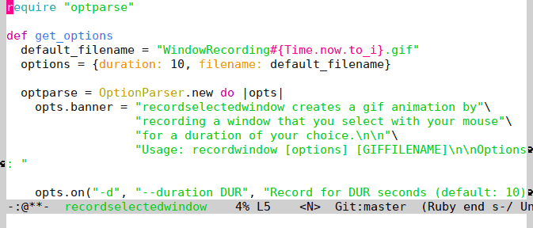
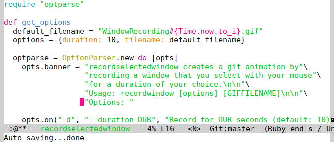

# recordselectedwindow
`recordselectedwindow` creates animated gif files by recording windows that are selected with mouse. It is a simple wrapper around `byzanz-record` and it relies on the tools `xdotool` and `xwininfo` for X. 

The default duration for recording is 10 seconds and the default filename for the animation is `WindowRecording{Timestamp}.gif`.

## Usage

To start recording a gif animation with filename `test1.gif`, we write

```
$ ./recordselectedwindow test1.gif
```

The recording starts when we choose a window with the mouse. Since the duration is not specified, the animation in `test1.gif` is a recording of 10 seconds. 



We can change the duration to 5 seconds by 

```
$ ./recordselectedwindow -d 5 test2.gif
```


